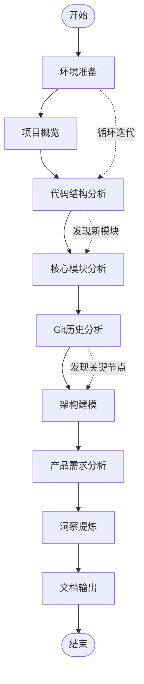
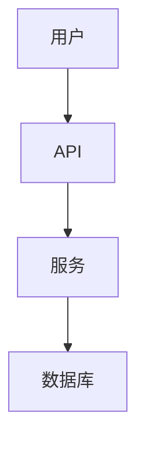

# 项目分析标准操作流程 (SOP)

## 文档信息

| 项目 | 内容 |
|------|------|
| 文档名称 | 项目分析标准操作流程 |
| 版本 | v1.0 |
| 目标 | 建立系统化的开源项目分析流程 |
| 适用场景 | 代码审查、技术调研、竞品分析 |

---

## 📋 流程概览



---

## 🛠️ 步骤 1: 环境准备

### 1.1 基础环境检查

```bash
# 检查系统性能
echo "=== CPU ===" && cat /proc/cpuinfo | grep "model name" | head -1
echo "=== Memory ===" && free -h
echo "=== Disk ===" && df -h
echo "=== OS ===" && cat /etc/os-release | grep PRETTY_NAME
```

### 1.2 必要工具安装

| 工具 | 用途 | 安装方式 |
|------|------|----------|
| git | 代码管理 | 系统自带 |
| python | 文档生成 | 已安装 |
| markdown | 文档编辑 | 编辑器 |

### 1.3 目标仓库分析

```bash
# 克隆或进入项目目录
cd /workspace/project

# 查看远程仓库信息
git remote -v
git branch -a
```

---

## 🔍 步骤 2: 项目概览

### 2.1 基本信息收集

| 信息项 | 收集方法 |
|--------|----------|
| 项目名称 | README.md |
| 编程语言 | 文件扩展名统计 |
| 许可证 | LICENSE 文件 |
| 描述 | README.md |
| stars/forks | GitHub API 或网页 |

### 2.2 项目结构概览

```bash
# 查看目录结构
ls -la
find . -maxdepth 2 -type d | head -20

# 查看主要文件
ls -la *.md
ls -la *.json
```

### 2.3 快速理解项目

**关键问题**:
1. 这是什么项目？
2. 解决什么问题？
3. 目标用户是谁？
4. 核心技术栈？

---

## 🏗️ 步骤 3: 代码结构分析

### 3.1 目录结构分析

```bash
# 分析目录结构
find . -type d -maxdepth 3 | sort

# 统计各目录文件数
for dir in $(find . -type d -maxdepth 2); do
    echo "$dir: $(find $dir -type f | wc -l) files"
done
```

### 3.2 核心模块识别

| 层级 | 分析重点 |
|------|----------|
| cmd/ | 入口点、CLI命令 |
| pkg/ | 核心业务逻辑 |
| internal/ | 内部实现 |
| api/ | API 定义 |
| config/ | 配置文件示例 |

### 3.3 依赖关系分析

```bash
# 查看依赖文件
cat go.mod  # Go 项目
cat package.json  # Node.js 项目
cat requirements.txt  # Python 项目

# 统计依赖数量
wc -l go.mod
```

---

## ⚙️ 步骤 4: 核心模块分析

### 4.1 关键模块深度分析

#### 选择标准
- 代码量大 (>1000 行)
- 被多次引用
- 核心业务逻辑

#### 分析方法
```bash
# 查看模块文件列表
ls -la pkg/核心模块名/

# 查看关键文件
cat pkg/核心模块名/*.go | head -100

# 分析导入关系
grep -r "import" pkg/核心模块名/ | head -20
```

### 4.2 设计模式识别

| 模式 | 识别方法 |
|------|----------|
| 工厂模式 | 大量 NewXXX() 函数 |
| 单例模式 | 全局变量 + GetInstance() |
| 策略模式 | 接口 + 多实现 |
| 观察者模式 | 事件/回调机制 |

### 4.3 数据流分析

```
入口点 → 核心处理 → 数据存储 → 输出
   ↓         ↓          ↓        ↓
  CLI    → Agent    → State   → Response
```

---

## 📊 步骤 5: Git 历史分析

### 5.1 提交历史分析

```bash
# 查看提交历史
git log --oneline | head -50
git log --oneline --since="2026-01-01"

# 按日期统计
git log --date=short --format="%ad" | sort | uniq -c

# 贡献者统计
git shortlog -sn | head -20
```

### 5.2 版本节点识别

```bash
# 查找关键版本标签
git tag -l
git log --oneline --all | grep -i "release\|version\|v1"

# 查看重大变更
git log --oneline --merges | head -10
```

### 5.3 阶段划分方法

1. **时间分界**: 按日期划分开发阶段
2. **功能标记**: 按功能标签（如 feat/fix/refactor）分类
3. **PR 合并**: 按 Pull Request 合并点划分

---

## 📐 步骤 6: 架构建模

### 6.1 架构图绘制

#### 必画图表

1. **系统概览图**: 整体架构分层
2. **数据流图**: 请求处理流程
3. **模块依赖图**: 组件关系
4. **部署图**: 运行环境

#### Mermaid 语法示例



### 6.2 架构文档编写

**必须包含**:
- 架构原则
- 分层说明
- 核心组件
- 数据流
- 部署方式

### 6.3 技术选型分析

| 技术 | 选择理由 | 替代方案 |
|------|----------|----------|
| Go | 轻量、高性能 | Rust, C++ |
| 消息总线 | 解耦 | 直接调用 |

---

## 📋 步骤 7: 产品需求分析

### 7.1 产品定位分析

| 维度 | 分析内容 |
|------|----------|
| 目标用户 | 谁会用这个产品？ |
| 核心价值 | 解决什么痛点？ |
| 竞争格局 | 替代品有哪些？ |

### 7.2 功能分层

```
核心功能 (MVP)
    ↓
重要功能
    ↓
辅助功能
```

### 7.3 阶段划分

基于 Git 历史，按功能特性划分开发阶段：

| 阶段 | 特征 |
|------|------|
| 阶段一 | 基础功能、MVP |
| 阶段二 | 功能扩展 |
| 阶段三 | 平台化 |
| 阶段四 | 优化稳定 |
| 阶段五 | 高级功能 |
| 阶段六 | 产品化 |

---

## 💡 步骤 8: 洞察提炼

### 8.1 核心洞察识别

**分析框架**:

| 维度 | 问题 |
|------|------|
| 技术 | 架构为什么这样设计？ |
| 产品 | 解决了什么需求？ |
| 团队 | 开发模式有什么特点？ |
| 市场 | 竞争优势是什么？ |

### 8.2 经验总结

- 成功因素
- 潜在风险
- 改进机会
- 可借鉴实践

---

## 📄 步骤 9: 文档输出

### 9.1 必输出文档

| 文档 | 描述 | 格式 |
|------|------|------|
| 架构文档 | 系统架构概览 | Markdown + Mermaid |
| 开发历史 | 版本演进 | Markdown |
| 产品需求 | 功能需求 | Markdown |
| 洞察报告 | 分析总结 | Markdown |
| SOP | 操作流程 | Markdown |

### 9.2 文档模板

```
# 文档标题

## 概述
简要说明

## 详细分析
### 1. xxx
### 2. xxx

## 结论
总结要点
```

### 9.3 版本控制

```bash
# 创建新分支
git checkout -b docs/analysis

# 添加文档
git add docs/
git commit -m "Add analysis documents"

# 推送到远程
git push origin docs/analysis
```

---

## ✅ 检查清单

### 开始分析前

- [ ] 了解项目基本背景
- [ ] 确认分析目标
- [ ] 准备分析环境

### 分析过程中

- [ ] 记录关键发现
- [ ] 标注重要代码位置
- [ ] 保存分析截图

### 分析完成后

- [ ] 整理所有文档
- [ ] 检查文档完整性
- [ ] 推送到远程仓库

---

## 📎 附录

### 常用命令速查

```bash
# Git 分析
git log --oneline --graph --all
git shortlog -sn
git diff --stat

# 代码统计
find . -name "*.go" | wc -l
wc -l $(find . -name "*.go")

# 项目结构
tree -L 2
```

### 文档模板位置

- 架构文档: `docs/architecture.md`
- 开发历史: `docs/development-history.md`
- 产品需求: `docs/product-requirements.md`
- 洞察报告: `docs/insights-report.md`

---

*文档版本: 1.0*
*创建时间: 2026-02-28*
*维护团队: OpenHands AI*
