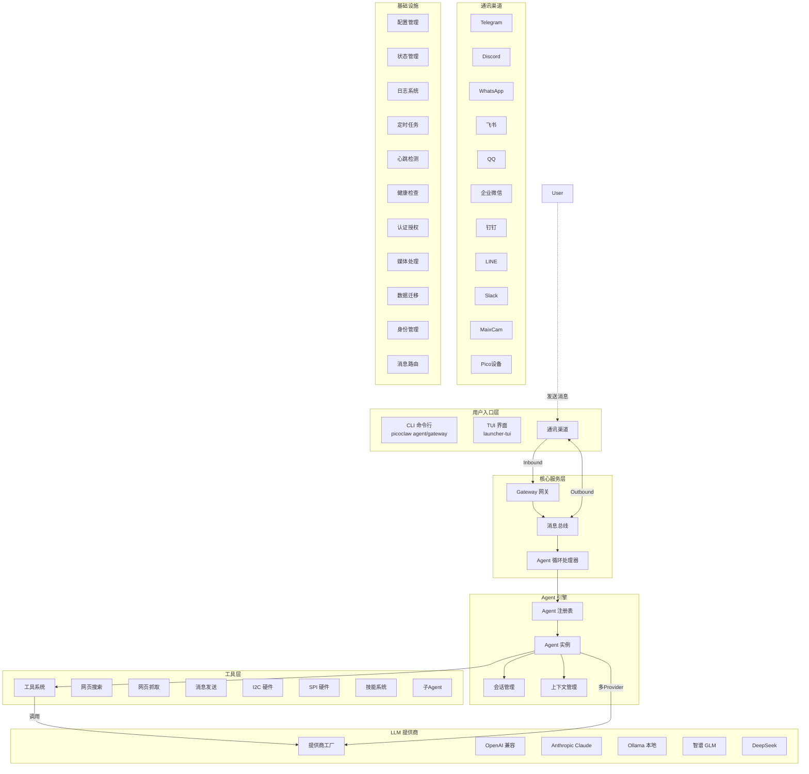
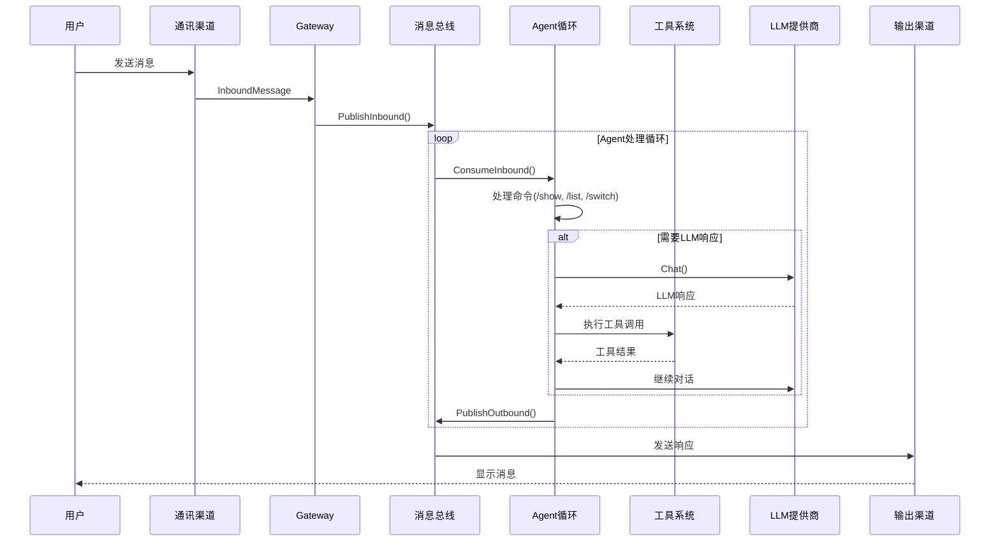
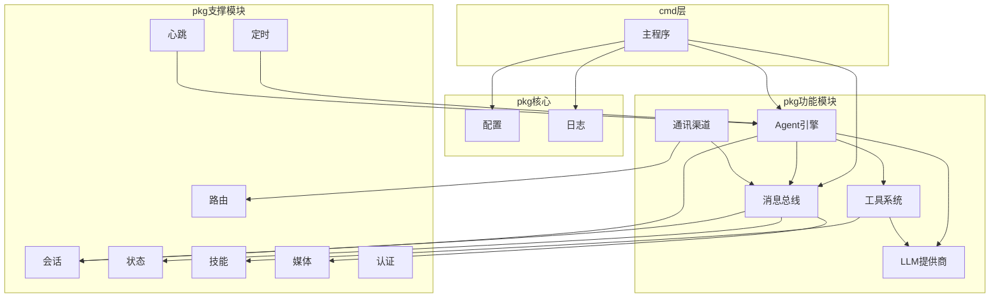

# PicoClaw 架构图

## 系统架构概览



## 核心数据流



## 模块依赖关系



## 配置文件结构

```json
{
  "model_list": [...],
  "agents": {
    "defaults": {
      "model": "gpt-5.2",
      "max_tokens": 8192,
      "temperature": 0.7,
      "workspace": "~/.picoclaw/workspace"
    }
  },
  "channels": {
    "telegram": {...},
    "discord": {...},
    "whatsapp": {...},
    "feishu": {...},
    "qq": {...}
  },
  "tools": {
    "web": {
      "brave": {...},
      "duckduckgo": {...}
    },
    "cron": {...}
  },
  "heartbeat": {...}
}
```

## 架构特点

### 1. 极简轻量
- **<10MB 内存占用** - 比 OpenClaw 减少 99%
- **<1秒 启动时间** - 在 0.6GHz 单核上
- **单一二进制** - 支持 RISC-V, ARM, x86

### 2. 模块化设计
- **消息总线解耦** - 各组件通过消息总线通信
- **Provider 抽象** - 支持多种 LLM 提供商
- **Channel 插件化** - 支持多种通讯渠道

### 3. AI 驱动开发
- 95% 代码由 AI Agent 生成
- 自我引导式架构迁移

### 4. 多渠道支持
- 即时通讯: Telegram, Discord, WhatsApp, QQ, 飞书, 钉钉, Line, Slack
- 物联网: MaixCam, Pico 设备

### 5. 丰富工具集
- Web: Brave Search, DuckDuckGo, Tavily, Perplexity
- 硬件: I2C, SPI
- 技能: 动态安装/发现技能
- 子Agent: 支持Spawn子Agent
