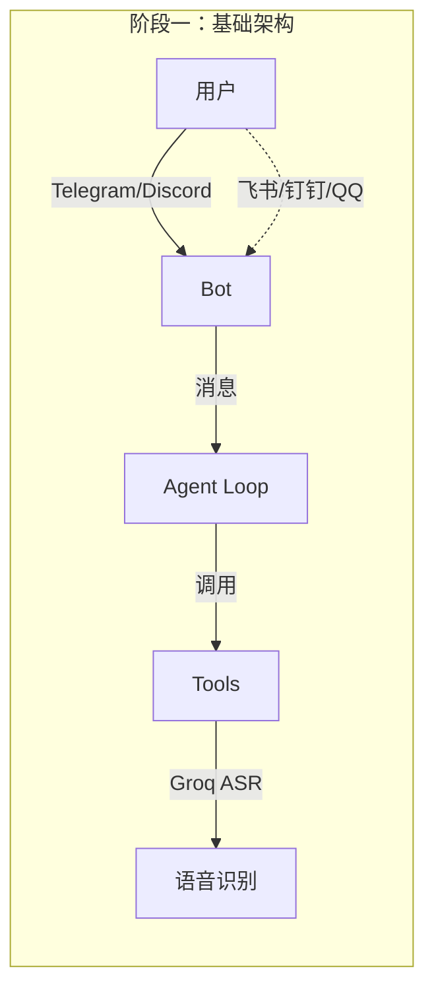
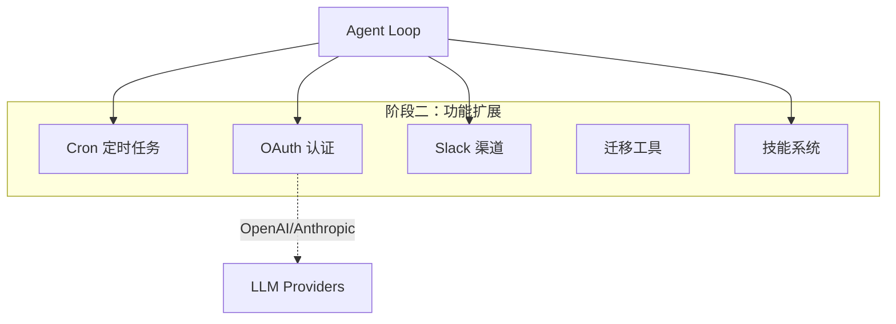
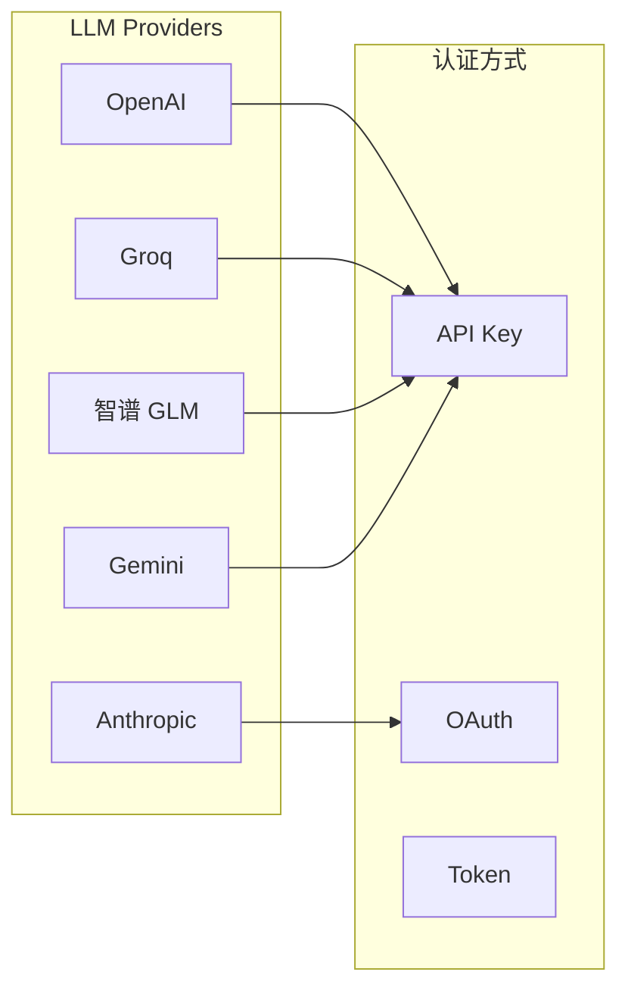
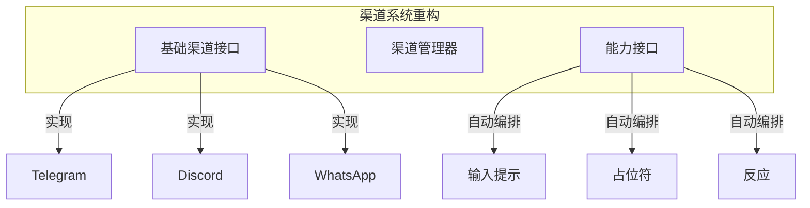
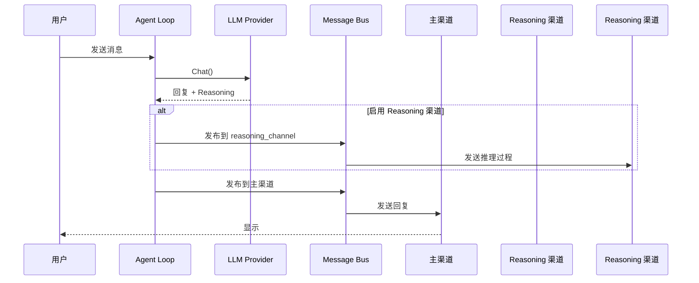
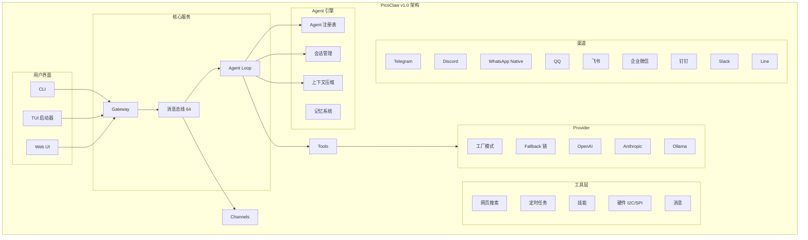
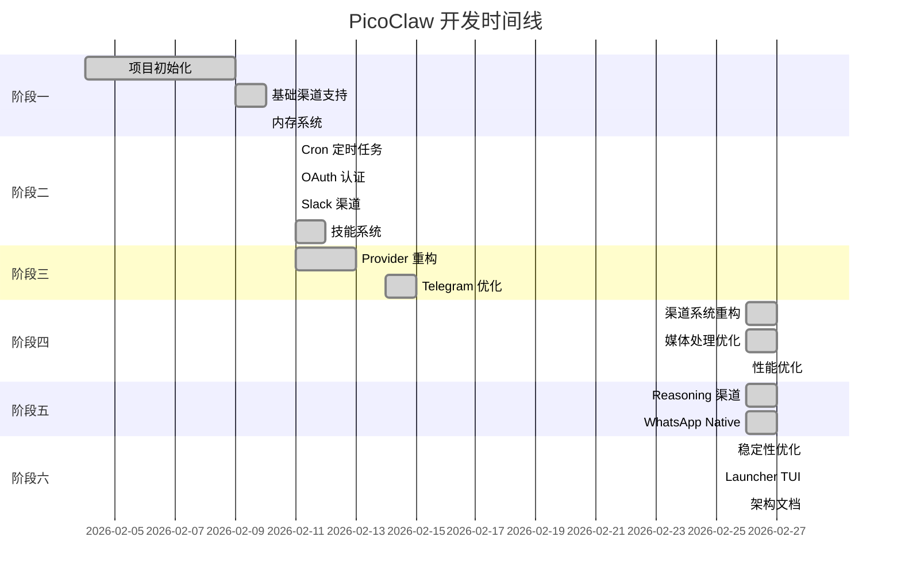

# PicoClaw 开发历史与架构演进

## 概述

本文档记录了 PicoClaw 项目从首个提交到当前版本的完整开发历史，根据提交记录梳理了软件架构的演进过程和功能迭代。

---

## 📅 开发阶段划分

### 第一阶段：奠基与初始功能 (2026-02-04 ~ 2026-02-10)

#### 关键提交

| 提交 | 日期 | 描述 |
|------|------|------|
| `e17693b` | 2026-02-04 | First commit - 项目初始化 |
| `b599a02` | 2026-02-09 | 修复拼写错误 |
| `5baae33` | 2026-02-09 | 添加微信群 |
| `f7d6a9c` | 2026-02-09 | 添加 Discord 群 |
| `ac945fa` | 2026-02-10 | 合并动态上下文压缩功能 |
| `f3f7ca7` | 2026-02-10 | 修复飞书消息流 |
| `91e7e18` | 2026-02-10 | 合并飞书修复 |
| `24d5e83` | 2026-02-10 | 添加硬件示例 |
| `9936dbc` | 2026-02-10 | Discord & Telegram 支持 ASR 通过 Groq |
| `c5f6bec` | 2026-02-10 | 添加钉钉渠道支持（流模式） |
| `2b3de5c` | 2026-02-10 | 添加 QQ 渠道支持 |
| `be2ed5d` | 2026-02-10 | 添加 Agent Loop 和工具执行的日志 |
| `1044273` | 2026-02-10 | 添加内存系统、调试模式和工具 |
| `21d60f6` | 2026-02-10 | 添加内存系统、动态工具加载和修复日志问题 |

#### 架构特点

**核心组件**:
- 基础 Agent 循环处理
- 消息系统
- 日志记录
- 基础工具集
- 内存系统

---

### 第二阶段：功能完善与工具扩展 (2026-02-11 ~ 2026-02-12)

#### 关键提交

| 提交 | 日期 | 描述 |
|------|------|------|
| `3e902ab` | 2026-02-11 | 合并 n0bisuke/main |
| `18bdbef` | 2026-02-11 | 修复 README 拼写错误 |
| `6d4d2bc` | 2026-02-11 | 添加 Cron 工具集成 |
| `4bc9e2d` | 2026-02-11 | 修复 Cron：添加一次性提醒和修复数据路径 |
| `af60ce2` | 2026-02-11 | 重构 Agent：提升代码质量并恢复摘要功能 |
| `c704990` | 2026-02-11 | 修复 BuildMessages 调用，添加 skills_available 字段 |
| `ae9cfc2` | 2026-02-11 | 修复拼写错误 |
| `9ec84c6` | 2026-02-11 | 修复拼写错误 |
| `f5b9191` | 2026-02-11 | 合并上游 main |
| `4f51441` | 2026-02-11 | 更新微信群二维码 |
| `6ccd9d0` | 2026-02-11 | 修复：优先处理显式 provider 前缀和更新 max_tokens schema |
| `5efe8a2` | 2026-02-11 | 添加 OAuth 和基于 token 的登录（OpenAI 和 Anthropic） |
| `fbad753` | 2026-02-11 | 添加基于 SDK 的 Provider 支持订阅 OAuth 登录 |
| `5eec80c` | 2026-02-11 | 添加 Slack 渠道集成（Socket Mode） |
| `3d54ec5` | 2026-02-11 | 添加 picoclaw migrate 命令用于 OpenClaw 工作空间迁移 |
| `83f6e44` | 2026-02-11 | 依赖升级：openai-go 从 v1.12.0 升级到 v3.21.0 |

#### 架构演进

**新增功能**:
- ⏰ Cron 定时任务和提醒
- 🔐 OAuth 认证（OpenAI/Anthropic）
- 💬 Slack 渠道（Socket Mode）
- 🔄 工作空间迁移工具
- 🎯 技能系统

---

### 第三阶段：Provider 系统重构与扩展 (2026-02-11 ~ 2026-02-13)

#### 关键提交

| 提交 | 日期 | 描述 |
|------|------|------|
| `8c8daf6` | 2026-02-11 | 合并 pr-12 |
| `7231d48` | 2026-02-11 | 合并 #5 QQ 渠道 |
| `94935c5` | 2026-02-11 | 修复拼写错误 |
| `f12c337` | 2026-02-12 | 移除重复 truncate 函数，复用 utils.Truncate |
| `eff0f49` | 2026-02-12 | 修复：使用 atomic.Bool 防止数据竞争 |
| `ddd6fca` | 2026-02-13 | 合并 #32 支持 OpenAI Anthropic OAuth 登录 |
| `66669d6` | 2026-02-13 | 合并 issue-27 添加迁移命令 |
| `167efc5` | 2026-02-13 | 合并 #33 OpenClaw 工作空间迁移 |
| `ca18958` | 2026-02-14 | 使用 Telego 替代 go-telegram-bot-api |
| `af3f659` | 2026-02-14 | 优化 README |
| `8ceef6e` | 2026-02-14 | 更好的版本号 |
| `91e8abf` | 2026-02-15 | 合并 #29 去重截断 |
| `fe59662` | 2026-02-15 | 合并 #30 修复 atomic running |
| `9be1cd6` | 2026-02-16 | 移除 nakedret |
| `b190e6e` | 2026-02-16 | 启用空白检查 |

#### Provider 架构

---

### 第四阶段：稳定性与渠道系统重构 (2026-02-26 ~ 2026-02-27)

#### 关键提交

| 提交 | 日期 | 描述 |
|------|------|------|
| `95b246f` | 2026-02-26 | 合并 #790 修复 Gemini prompt cache key |
| `a5cc4db` | 2026-02-26 | CI：移除 rpm 和 deb 文件名中的版本号 |
| `b705e58` | 2026-02-26 | 修复媒体：处理 TTL 清理的评论 |
| `d804f9c` | 2026-02-26 | 修复媒体：保护 Interval<=0 崩溃，两阶段 ReleaseAll |
| `e450e9e` | 2026-02-26 | 添加 Line 的 StartTyping 和 PlaceholderRecorder 集成 |
| `6a4116b` | 2026-02-26 | CI：修复 go generate 不在子目录运行 |
| `438f764` | 2026-02-26 | 支持 model_list 中每模型 request_timeout |
| `21654f1` | 2026-02-26 | 修改默认 dm_scope 为 per-channel-peer |
| `f3c1162` | 2026-02-26 | 技能：添加 HTTP 请求重试 |
| `b1c61cd` | 2026-02-26 | 合并 #808 修改默认 DM scope |
| `8a1fb03` | 2026-02-26 | 性能：预编译正则表达式 |
| `e268ea8` | 2026-02-26 | 撤销 "添加 Line StartTyping" |
| `a161bf9` | 2026-02-26 | 合并 main 分支 |
| `d887009` | 2026-02-26 | 合并：解决与 main 的冲突 |
| `433af43` | 2026-02-26 | 样式：修复 config、cron 和 skills installer 的 gci 导入分组 |
| `94aa2b1` | 2026-02-26 | 修复媒体：使用项目日志并加强 map 清理 |
| `0a7c929` | 2026-02-26 | 修复媒体：分离 gci linter 导入组 |
| `3584c0c` | 2026-02-26 | 合并 #766 修复假上下文截止时间 |
| `1d4fe46` | 2026-02-26 | 修复总线：消息总线缓冲区从 16 增加到 64 |
| `35a035b` | 2026-02-26 | 修复：重基后端口 main 分支更改到渠道子包 |
| `ba98069` | 2026-02-26 | 修复：解决渠道子包中浪费赋值的 lint 警告 |
| `fb96645` | 2026-02-26 | 修复 providers：支持基于查找的 fallback 候选解析 |
| `3a38623` | 2026-02-26 | 修复 agent：从 model_list 解析 fallback 模型别名 |
| `99582bb` | 2026-02-26 | 添加 issue 783 调查和执行计划 |
| `b8c0d13` | 2026-02-27 | 合并 fix/atomic-file-writes |
| `29ed650` | 2026-02-27 | 添加渠道自动编排 Placeholder/Typing/Reaction |
| `e5788e7` | 2026-02-27 | 添加中文渠道系统架构 README |
| `779e4df` | 2026-02-27 | 添加英文渠道系统架构 README |
| `a5c8179` | 2026-02-27 | Docker：重组 Docker 文件并添加首次运行入口 |

#### 架构变化

**重大改进**:
- 渠道系统架构重构
- 消息总线缓冲区优化（16→64）
- 媒体处理改进
- 正则表达式预编译性能优化
- 错误处理和稳定性修复

---

### 第五阶段：Reasoning 与高级功能 (2026-02-26 ~ 2026-02-27)

#### 关键提交

| 提交 | 日期 | 描述 |
|------|------|------|
| `9f95aad` | 2026-02-26 | 引入 LLM reasoning 字段并支持路由到专用渠道 |
| `f96cf3f` | 2026-02-26 | 添加 reasoning_channel_id 配置和改进消息总线上下文取消 |
| `29d4019` | 2026-02-27 | 设置 max tokens 为 32k，默认 model 为 null |
| `d429dcd` | 2026-02-27 | 修复 go fmt 格式化问题 |
| `90e49bc` | 2026-02-27 | 合并 #802 reasoning-chnl |
| `fa68023` | 2026-02-27 | 合并 refactor/channel-system 到 main |
| `7276a2d` | 2026-02-27 | 修复 lint 错误 |
| `6fcc80b` | 2026-02-27 | 重新格式化 WhatsAppConfig 结构体字段对齐 |
| `3ad937f` | 2026-02-27 | 更新 SanitizeMessageContent 函数注释 |
| `67e1dab` | 2026-02-27 | 更新 Unicode 字母保留测试用例 |
| `6b427af` | 2026-02-27 | 从 .gitignore 移除忽略文件 |
| `75a86eb` | 2026-02-27 | 解决 config.example.json 合并冲突 |
| `f6c275f` | 2026-02-27 | 修复 WhatsAppConfig 结构体字段格式化 |
| `c119e0d` | 2026-02-27 | 合并 #655 添加 WhatsApp |
| `42ee9ab` | 2026-02-26 | 完成基于新渠道接口的 WhatsApp Native 渠道实现 |
| `a8644ca` | 2026-02-26 | 基于新渠道接口重构 WhatsApp Native |
| `a91a4e5` | 2026-02-27 | 更新微信二维码并删除未使用的 mp4 文件 |
| `b6927c9` | 2026-02-27 | 提示修改 max_tool_iterations 参数 |

#### Reasoning 功能架构

---

### 第六阶段：稳定性优化与发布准备 (2026-02-28)

#### 关键提交

| 提交 | 日期 | 描述 |
|------|------|------|
| `2f4f450` | 2026-02-28 | 合并 #882 修复 issue#565 |
| `cdbc9c4` | 2026-02-28 | 合并 sipeed/main 到 main |
| `c7d75a1` | 2026-02-28 | 修复 WhatsApp Native：修复 Start/Stop 生命周期中的 goroutine 和资源泄漏 |
| `1d0220f` | 2026-02-28 | 修复 Agent：防止满载总线时 reasoning goroutine 积累 |
| `9b80fdf` | 2026-02-28 | 修复 PR #884 评论反馈 |
| `fc28c26` | 2026-02-28 | 修复 WhatsApp Native：关闭 eventHandler 和 Stop 之间的 TOCTOU 竞态 |
| `d1b10a0` | 2026-02-28 | 修复第二轮评论反馈 |
| `7f425f1` | 2026-02-28 | 修复 Agent：更正 "canceled" 拼写错误 |
| `8529abb` | 2026-02-28 | 合并 #681 修复假上下文截止时间 |
| `871b2d7` | 2026-02-28 | 修复 WhatsApp Native、Agent：修复资源泄漏和日志噪音 |
| `feee0da` | 2026-02-28 | 合并 #884 修复 WhatsApp reasoning 内存泄漏 |
| `6c8866d` | 2026-02-28 | 修复：启动时没有启用渠道时传播错误 |
| `172e6eb` | 2026-02-28 | 修复 Exec：无效拒绝模式时失败关闭 |
| `5e028a8` | 2026-02-28 | 添加 picoclaw-launcher 带 Web UI 配置和网关管理 |
| `27e988c` | 2026-02-28 | 添加可配置的启动器和网关进程管理 |
| `8207c1c` | 2026-02-28 | 更新迁移功能 |
| `62f59f7` | 2026-02-28 | 修复 Wecom：使用渠道上下文而非 HTTP 请求上下文处理异步消息 |
| `8e06e2a` | 2026-02-28 | 修复 Wecom：在构造函数中初始化上下文防止测试中 nil  panic |
| `9c9524f` | 2026-02-28 | 合并 #914 修复 Wecom 上下文取消 |
| `fe6e369` | 2026-02-28 | 添加架构文档和图表 |

#### 最新架构

---

## 📊 版本演进统计

### 功能时间线

### 代码量统计（估计）

| 阶段 | 提交数 | 主要功能 |
|------|--------|----------|
| 阶段一 | ~15 | 基础框架、渠道、内存 |
| 阶段二 | ~15 | Cron、OAuth、Slack、迁移 |
| 阶段三 | ~15 | Provider、认证 |
| 阶段四 | ~30 | 渠道重构、媒体、性能 |
| 阶段五 | ~20 | Reasoning、WhatsApp |
| 阶段六 | ~20 | 稳定性、Launcher、文档 |

---

## 🎯 各阶段架构对比

### 阶段一 vs 阶段六

| 特性 | 阶段一 (v0.1) | 阶段六 (v1.0) |
|------|---------------|---------------|
| 消息处理 | 简单循环 | 带缓冲的消息总线 (64) |
| Provider | 单一 | 多 Provider + Fallback |
| 渠道 | 4 个 | 10+ 个 |
| 工具 | 基础 | Web/Cron/Skills/硬件 |
| 认证 | API Key | API Key + OAuth |
| 内存管理 | 基础 | 动态上下文压缩 |
| UI | CLI | CLI + TUI + Web |
| 稳定性 | 实验性 | 生产级 |

---

## 🔮 未来展望

基于当前架构，PicoClaw 的发展方向可能包括：

1. **更多 AI 模型支持** - 集成更多 LLM 提供商
2. **语音/视频处理** - 增强媒体处理能力
3. **插件系统** - 更灵活的扩展机制
4. **云部署** - 原生 Kubernetes 支持
5. **企业功能** - ACL、审计、多租户

---

*文档最后更新: 2026-02-28*
