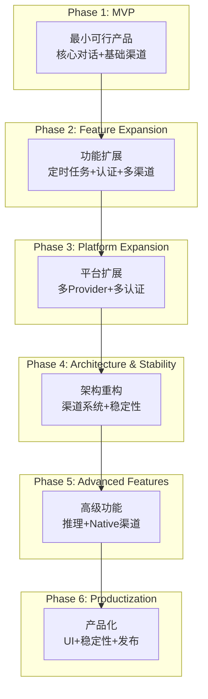
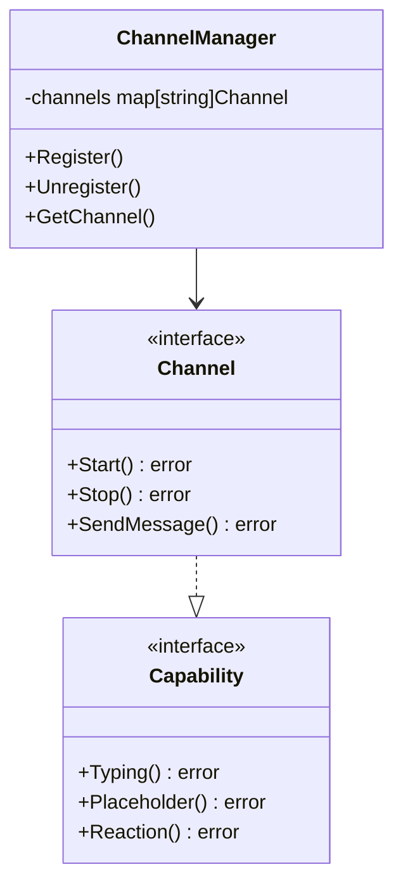
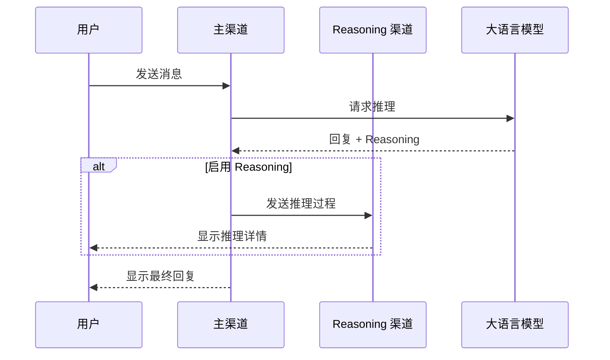

# PicoClaw 产品需求文档 (PRD)

## 文档信息

| 项目 | 内容 |
|------|------|
| 产品名称 | PicoClaw |
| 产品定位 | 超轻量级个人 AI 助手 |
| 目标用户 | 个人用户、开发者、物联网爱好者 |
| 文档版本 | v1.0 |
| 更新日期 | 2026-02-28 |

---

## 📋 产品概述

### 1.1 产品愿景

**一句话描述**: 在 10 美元硬件上运行的超轻量级个人 AI 助手

**核心价值主张**:
- ⚡ **极低成本**: 10 美元硬件，<10MB 内存
- 🚀 **极速启动**: 1 秒内启动
- 🌍 **真正便携**: 单一二进制，跨平台运行

---

## 🎯 产品定位与目标市场

### 1.2 目标用户

| 用户群体 | 使用场景 | 需求痛点 |
|----------|----------|----------|
| 个人开发者 | 本地 AI 助手、自动化任务 | 资源占用高、成本高 |
| 物联网爱好者 | 智能设备控制、边缘计算 | 硬件要求高、部署复杂 |
| 技术爱好者 | 聊天机器人、语音助手 | 配置复杂、维护困难 |
| 低资源用户 | 老旧设备复用 | 现代 AI 无法运行 |

### 1.3 竞争分析

| 特性 | OpenClaw | NanoBot | **PicoClaw** |
|------|----------|---------|--------------|
| 语言 | TypeScript | Python | **Go** |
| 内存 | >1GB | >100MB | **<10MB** |
| 启动 | >500s | >30s | **<1s** |
| 成本 | $599 | ~$50 | **$10** |

---

## 📊 产品路线图与阶段划分

### 产品阶段总览



---

## 📦 阶段一：最小可行产品 (MVP)

### 时间范围
**2026-02-04 ~ 2026-02-10**

### 产品目标
构建一个可运行的基础 AI 助手，实现核心对话功能和基础通讯渠道接入。

### 需求来源
- 验证超轻量级 AI 助手的可行性
- 快速验证产品核心假设
- 获取早期用户反馈

### 核心功能

| 功能模块 | 功能描述 | 优先级 | 技术实现 |
|----------|----------|--------|----------|
| **AI 对话** | 基于 LLM 的自然语言对话 | P0 | Agent Loop |
| **内存管理** | 会话历史管理、上下文保持 | P0 | Session Manager |
| **日志系统** | 完整的运行日志记录 | P0 | Logger |
| **Telegram 渠道** | Telegram Bot 接入 | P0 | Telego 库 |
| **Discord 渠道** | Discord Bot 接入 | P0 | discord.go |
| **飞书渠道** | 飞书消息接收和回复 | P1 | 飞书 API |
| **钉钉渠道** | 钉钉消息接收和回复 | P1 | 钉钉 Stream Mode |
| **QQ 渠道** | QQ 消息接收和回复 | P1 | OneBot 协议 |
| **Web 搜索** | 基础网页搜索功能 | P1 | DuckDuckGo |

### 用户故事

```
作为用户，我希望能够通过 Telegram/Discord/飞书/钉钉/QQ 向 AI 助手发送消息并获得回复，
以便随时随地与 AI 助手交互。

作为用户，我希望 AI 助手能够记住之前的对话内容，
以便进行连贯的多轮对话。

作为用户，我希望能够通过语音与 AI 助手交互，
以便解放双手进行操作。
```

### 验收标准

- [ ] 用户可通过任一渠道发送消息并获得 AI 回复
- [ ] 多轮对话上下文保持正常
- [ ] 系统日志完整记录运行状态
- [ ] 内存占用 <50MB
- [ ] 启动时间 <10 秒

### 关键提交

| 提交 | 功能 |
|------|------|
| `e17693b` | 项目初始化，第一个提交 |
| `2b3de5c` | 添加 QQ 渠道支持 |
| `c5f6bec` | 添加钉钉渠道支持 |
| `f3f7ca7` | 修复飞书消息流 |
| `be2ed5d` | 添加 Agent Loop 和工具执行日志 |
| `1044273` | 添加内存系统、调试模式和工具 |
| `21d60f6` | 添加内存系统、动态工具加载 |

---

## 📦 阶段二：功能扩展

### 时间范围
**2026-02-11 ~ 2026-02-12**

### 产品目标
扩展核心功能，增加定时任务、认证系统和更多渠道支持。

### 需求来源
- 用户需要定时执行任务
- 用户需要更安全的认证方式
- 用户需要更多通讯渠道接入

### 核心功能

| 功能模块 | 功能描述 | 优先级 | 技术实现 |
|----------|----------|--------|----------|
| **Cron 定时任务** | 定时提醒、周期性任务执行 | P0 | Cron 表达式解析 |
| **一次性提醒** | 指定时间的一次性提醒 | P0 | 定时器 + 持久化 |
| **OAuth 认证** | OpenAI/Anthropic OAuth 登录 | P0 | OAuth 2.0 流程 |
| **API Token 认证** | 基于 Token 的认证 | P0 | Token 验证 |
| **Slack 渠道** | Slack App 接入 | P1 | Socket Mode |
| **工作空间迁移** | 从 OpenClaw 迁移配置 | P1 | migrate 命令 |
| **技能系统** | 动态发现和安装技能 | P1 | Skill Registry |

### 用户故事

```
作为用户，我希望能够设置定时提醒，
以便在指定时间收到 AI 助手的通知。

作为用户，我希望能够通过 OAuth 方式登录 OpenAI/Anthropic 账户，
以便安全地使用我的 API 配额。

作为用户，我希望能够在 Slack 上与 AI 助手交互，
以便在工作场景中使用。

作为用户，我希望能够从旧版本平滑迁移到新版本，
以便保留我的配置和历史记录。
```

### 验收标准

- [ ] Cron 表达式正确执行
- [ ] OAuth 认证流程完整
- [ ] Slack 渠道消息收发正常
- [ ] 技能可动态发现和安装

### 关键提交

| 提交 | 功能 |
|------|------|
| `6d4d2bc` | 添加 Cron 工具集成 |
| `4bc9e2d` | 修复 Cron，添加一次性提醒 |
| `5efe8a2` | 添加 OAuth 和 Token 登录 |
| `5eec80c` | 添加 Slack 渠道集成 |
| `3d54ec5` | 添加工作空间迁移命令 |
| `f3c1162` | 技能系统 HTTP 重试 |

---

## 📦 阶段三：平台扩展

### 时间范围
**2026-02-11 ~ 2026-02-13**

### 产品目标
扩展 LLM Provider 支持，构建多 Provider 架构。

### 需求来源
- 用户需要选择不同的 AI 模型
- 用户需要负载均衡和高可用
- 用户需要灵活的配置方式

### 核心功能

| 功能模块 | 功能描述 | 优先级 | 技术实现 |
|----------|----------|--------|----------|
| **Provider 工厂** | 统一的 LLM Provider 创建 | P0 | Factory 模式 |
| **多模型配置** | 配置多个模型列表 | P0 | model_list |
| **负载均衡** | 同一模型多端点轮询 | P1 | Round-robin |
| **Fallback 链** | 主 Provider 失败自动切换 | P1 | Fallback 链 |
| **超时配置** | 每模型独立超时设置 | P1 | request_timeout |
| **别名解析** | 模型别名到实际模型映射 | P1 | Alias 映射 |

### 用户故事

```
作为用户，我希望能够配置多个 LLM Provider，
以便在不同场景使用不同模型。

作为用户，我希望能够配置同一模型的多个 API 端点，
以便实现负载均衡。

作为用户，我希望能够在主 Provider 失败时自动切换到备用 Provider，
以保证服务可用性。
```

### 验收标准

- [ ] 可配置多个 Provider
- [ ] 负载均衡正常工作
- [ ] Fallback 切换正常

---

## 📦 阶段四：架构重构与稳定性

### 时间范围
**2026-02-26 ~ 2026-02-27**

### 产品目标
重构核心架构，提升系统稳定性和性能。

### 需求来源
- 渠道代码重复，维护困难
- 性能瓶颈需要优化
- 需要更稳定的消息处理

### 核心功能

| 功能模块 | 功能描述 | 优先级 | 技术实现 |
|----------|----------|--------|----------|
| **渠道系统重构** | 统一渠道接口和架构 | P0 | Channel 接口 + Manager |
| **能力接口** | 自动编排 Typing/Placeholder/Reaction | P0 | Capability 接口 |
| **消息总线优化** | 缓冲区从 16 扩大到 64 | P0 | 性能调优 |
| **媒体处理** | 媒体文件管理 | P1 | Media Store |
| **正则预编译** | 预编译正则表达式提升性能 | P1 | 性能优化 |
| **错误处理** | 统一的错误处理机制 | P1 | Error 分类 |

### 技术架构改进



### 用户故事

```
作为开发者，我希望渠道有统一的接口，
以便更方便地添加新渠道。

作为用户，我希望消息处理更加稳定，
以减少消息丢失的风险。

作为用户，我希望系统性能更好，
以获得更快的响应速度。
```

### 验收标准

- [ ] 新渠道可通过实现接口快速接入
- [ ] 消息处理稳定性提升
- [ ] 系统响应时间改善

---

## 📦 阶段五：高级功能

### 时间范围
**2026-02-26 ~ 2026-02-27**

### 产品目标
增加高级功能，提升产品竞争力。

### 需求来源
- 用户需要查看 AI 的推理过程
- 用户需要更好的 WhatsApp 体验

### 核心功能

| 功能模块 | 功能描述 | 优先级 | 技术实现 |
|----------|----------|--------|----------|
| **Reasoning 渠道** | 将 AI 推理过程输出到专用渠道 | P0 | 推理路由 |
| **Reasoning 字段** | LLM 响应中增加 reasoning 字段 | P0 | Provider 适配 |
| **WhatsApp Native** | 原生 WhatsApp 渠道支持 | P0 | WhatsApp Business API |
| **上下文压缩** | 动态压缩长对话 | P1 | Token 估算 + 摘要 |

### Reasoning 功能架构



### 用户故事

```
作为用户，我希望能够看到 AI 的思考过程，
以便更好地理解 AI 的回答。

作为用户，我希望能够通过 WhatsApp 与 AI 助手交互，
以便使用更广泛的通讯渠道。
```

### 验收标准

- [ ] Reasoning 内容正确输出到指定渠道
- [ ] WhatsApp Native 消息收发正常

---

## 📦 阶段六：产品化

### 时间范围
**2026-02-28**

### 产品目标
完善用户体验，准备正式发布。

### 需求来源
- 需要更友好的配置方式
- 需要完整的文档
- 需要生产级稳定性

### 核心功能

| 功能模块 | 功能描述 | 优先级 | 技术实现 |
|----------|----------|--------|----------|
| **Web UI** | 图形化配置界面 | P0 | Web 服务器 |
| **TUI 启动器** | 终端图形化启动器 | P0 | TUI 框架 |
| **进程管理** | Gateway 进程管理 | P0 | 进程控制 |
| **资源泄漏修复** | 修复 goroutine 和内存泄漏 | P0 | 生命周期管理 |
| **错误传播** | 改进错误处理和传播 | P1 | Error 包装 |
| **文档完善** | 完整的产品文档 | P1 | Markdown |

### 用户故事

```
作为用户，我希望能够通过 Web 界面配置 AI 助手，
以便更直观地进行设置。

作为用户，我希望能够在终端中通过图形界面启动和管理服务，
以便获得更好的使用体验。

作为用户，我希望系统稳定运行不崩溃，
以便生产环境使用。
```

### 验收标准

- [ ] Web UI 可正常配置所有选项
- [ ] TUI 启动器正常工作
- [ ] 无明显的资源泄漏

---

## 📊 功能对比矩阵

| 功能 | 阶段一 | 阶段二 | 阶段三 | 阶段四 | 阶段五 | 阶段六 |
|------|:------:|:------:|:------:|:------:|:------:|:------:|
| **AI 对话** | ✅ | ✅ | ✅ | ✅ | ✅ | ✅ |
| **多渠道** | 4+ | 5+ | 5+ | 10+ | 10+ | 10+ |
| **定时任务** | - | ✅ | ✅ | ✅ | ✅ | ✅ |
| **认证** | - | OAuth | OAuth+ | OAuth+ | OAuth+ | OAuth+ |
| **多 Provider** | - | - | ✅ | ✅ | ✅ | ✅ |
| **负载均衡** | - | - | ✅ | ✅ | ✅ | ✅ |
| **Fallback** | - | - | ✅ | ✅ | ✅ | ✅ |
| **渠道重构** | - | - | - | ✅ | ✅ | ✅ |
| **Reasoning** | - | - | - | - | ✅ | ✅ |
| **WhatsApp Native** | - | - | - | - | ✅ | ✅ |
| **Web UI** | - | - | - | - | - | ✅ |
| **TUI** | - | - | - | - | - | ✅ |

---

## 🔮 未来规划 (Roadmap)

### 短期 (v1.1 - v1.2)
- [ ] 更多 LLM Provider 支持
- [ ] 语音/视频消息处理
- [ ] 插件系统

### 中期 (v1.3 - v1.5)
- [ ] Kubernetes 部署支持
- [ ] 多语言支持
- [ ] 企业级功能 (ACL、审计)

### 长期 (v2.0)
- [ ] 完全原生移动端支持
- [ ] 离线运行能力
- [ ] 边缘计算优化

---

## 📎 附录

### 术语表

| 术语 | 定义 |
|------|------|
| Provider | LLM 服务提供商 |
| Channel | 通讯渠道（Telegram、Discord 等） |
| Agent | AI 代理实例 |
| Session | 会话上下文 |
| Reasoning | AI 推理过程 |
| Fallback | 失败时备用方案 |
| Skills | 可动态安装的功能扩展 |

### 参考资料

- 技术架构文档: `docs/architecture.md`
- 开发历史: `docs/development-history.md`
- 渠道配置: `docs/channels/`
- 配置示例: `config/config.example.json`

---

*文档版本: 1.0*
*最后更新: 2026-02-28*
*产品经理: PicoClaw Team*
